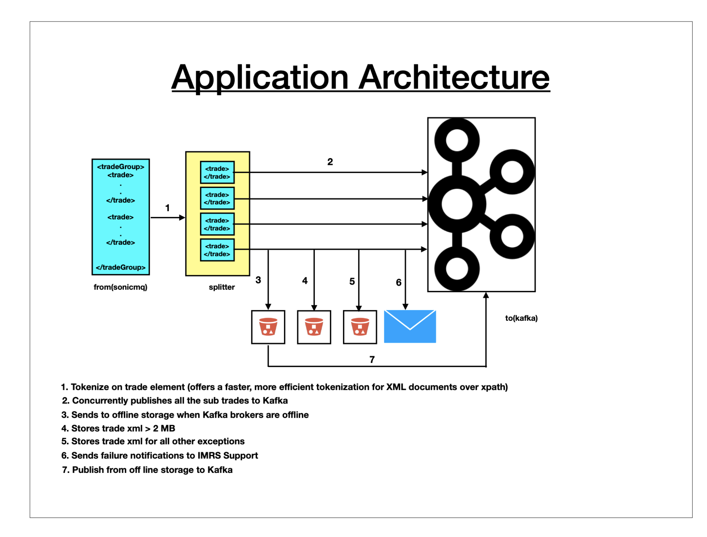
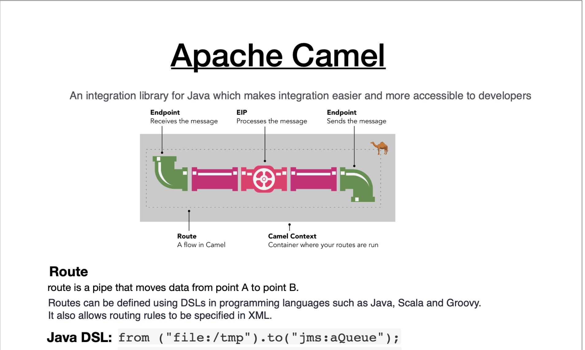

# Sonic Kafka Bridge

## Application Architecture


## Camel Architectural Components


## Implement SonicMQ as Camel component

```java
from("sonicmq:topic:{{SonicMQ.destination}}?clientId={{SonicMQ.clientId}}&durableSubscriptionName={{SonicMQ.subscription}}")
                .routeId(
                        "Sonic.{{SonicMQ.destination}}-Kafka.{{spring.kafka.targetTradeXMLTopic}}")
                .split()
                .tokenizeXML("trade")
                .streaming()
                .parallelProcessing()
                .removeHeaders("*")
                .to("kafka:{{spring.kafka.targetTradeXMLTopic}}?brokers={{spring.kafka.bootstrap-servers}}&requestTimeoutMs={{spring.kafka.producer-requestTimeoutMs}}&clientId={{SonicMQ.clientId}}");
      